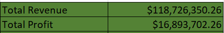
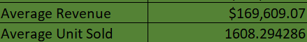
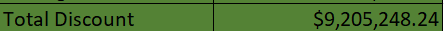
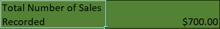
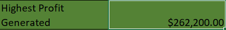
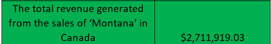
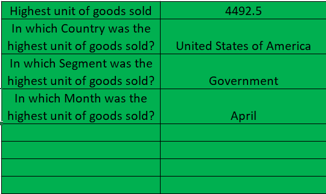

# Sales Data Analysis
---

---
## Introduction
#### This data analysis entails Sales Information for **Company QT**. It includes data columns for sales, cost of goods sold, country, Date, Discount Band, Discounts, Gross Sales, Manufacturing Price, Month Name, Month Number, Product, Profit, Sale Price, Segment, Units Sold, Year and Sales Range. 
Kindly feel free to interact with data (https://github.com/SeunA88/Sales-Data-Analysis/blob/main/Sales_Data.xlsx).

Analysis of this data was carried out to show the ability to use some basic and advanced functions in Excel. Firstly, each column was formatted to depict the data therein. These functions were then used to determine the following insights from the data:
1.	The total Revenue and Profit generated
2.	The average Revenue and Units Sold for every order
3.	The total Discount given in $
4.	Total number of sales recorded
5.	The highest Profit generated
6.	Create a column named ‘Sales Range’, return ‘High Sales’ if the Sales value is above average, otherwise, return ‘Low Sales’.
7.	The average revenue generated from each sale of ‘Paseo’
8.	The number of sales made in the Government and Midmarket segment
9.	The total revenue generated from the sales of ‘Montana’ in Canada
10.	In which Country, Segment and Month was the highest unit of goods sold?
11.	What is the total profit made in December?

## Result of Analysis
-	The total Revenue and Profit generated.

This was determined using the SUM function on the sales column “=SUM(A2:A701)” for total revenue and “=SUM(L2:L701)” for total profit generated on the profit column.

-	The average Revenue and Units Sold for every order

This was determined using the AVERAGE function on the sales column“=AVERAGE(A2:A701)” for average revenue and “=AVERAGE(O2:O701)” for average units sold for every order on the number of units sold column.

-	The total Discount given in $

This was determined using the SUM function on the discount column “=SUM(F2:F701)”

-	Total number of sales recorded

This was determined using the COUNT function on the sales column “=COUNT(A2:A701)”

-	The highest Profit generated

This was determined using the MAX function on the profit column “=MAX(L2:L701)”

-	Create a column named ‘Sales Range’, return ‘High Sales’ if the Sales value is above average, otherwise, return ‘Low Sales’.

This was determined using the IF function based on average sales as the logical test “=IF(A2>$U$14, "High sales", "Low sales")”

Link here (https://github.com/SeunA88/Sales-Data-Analysis/blob/main/Sales_Data.xlsx) shows the new column achieved using this function for this analysis.

- The average revenue generated from each sale of ‘Paseo’

This was determined using the AVERAGEIF function "=AVERAGEIF(K2:K701, "Paseo", A2:A701)"

- The number of sales made in the Government and Midmarket segment

This was determined using the COUNTIF function "=(COUNTIF(N2:N701,"Government")+COUNTIF(N2:N701,"Midmarket"))"

- The total revenue generated from the sales of ‘Montana’ in Canada

This was determined using the SUMIFS function "=SUMIFS(A2:A701,C2:C701,"Canada",K2:K701,"Montana")"

- In which Country, Segment and Month was the highest unit of goods sold?

This was determined using the determining the highest unit sold first using the MAX function, rearranging the columns before using the VLOOKUP function (check here: https://github.com/SeunA88/Sales-Data-Analysis/blob/main/Adjusted_sales_data.xlsx) and then using VLOOKUP function to select out the Country, segment and month with the highest unit of goods sold e.g. "=VLOOKUP(T7, L2:N701, 3, FALSE)"

- 	What is the total profit made in December?

This was determined using the SUMIF function "=SUMIF(I2:I701, "December", L2:L701)"

## Analysis Insights
From this analysis, an overview and understanding of Company QT"s performance in Sales has been disclosed. This was achieved by insights generated from the above analysis which include Total Revenue, Total Profit, Maximum profit, generated above among others. Noteworthy is the Country- United States of America, Segment- Government and Month- April where the highest unit of goods was sold. 

## Conclusion
Using basic and advanced functions in Excel, insights have been generated from the Sales data of Company QT and further insights can still be generated from the data, which will be useful for stakeholders to make informed decisions. 

