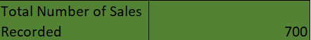

# Sales Data Analysis
---

---
## Introduction
#### This data entails Sales Information for **Company QT**. It includes data columns for sales, cost of goods sold, country, Date, Discount Band, Discounts, Gross Sales, Manufacturing Price, Month Name, Month Number, Product, Profit, Sale Price, Segment, Units Sold, Year and Sales Range. 
Kindly feel free to interact with data (https://github.com/SeunA88/Sales-Data-Analysis/blob/main/Sales_Data.xlsx).

Analysis of this data was carried out to show the ability to use some basic functions in Excel. Firstly, each column was formatted to depict the data therein. These functions were then used to determine the following insights from the data:
1.	The total Revenue and Profit generated
2.	The average Revenue and Units Sold for every order
3.	The total Discount given in $
4.	Total number of sales recorded
5.	The highest Profit generated
6.	Create a column named ‘Sales Range’, return ‘High Sales’ if the Sales value is above average, otherwise, return ‘Low Sales’.

## Result of Analysis
-	The total Revenue and Profit generated.

This was determined using the SUM function on the sales column “=SUM(A2:A701)” for total revenue and “=SUM(L2:L701)” for total profit generated on the profit column.

-	The average Revenue and Units Sold for every order

This was determined using the AVERAGE function on the sales column“=AVERAGE(A2:A701)” for average revenue and “=AVERAGE(O2:O701)” for average units sold for every order on the number of units sold column.

-	The total Discount given in $

This was determined using the SUM function on the discount column “=SUM(F2:F701)”

-	Total number of sales recorded

This was determined using the COUNT function on the sales column “=COUNT(A2:A701)”

-	The highest Profit generated

This was determined using the MAX function on the profit column “=MAX(L2:L701)”

-	Create a column named ‘Sales Range’, return ‘High Sales’ if the Sales value is above average, otherwise, return ‘Low Sales’.

This was determined using the IF function based on average sales as the logical test “=IF(A2>$U$14, "High sales", "Low sales")”

Link here (https://github.com/SeunA88/Sales-Data-Analysis/blob/main/Sales_Data.xlsx) shows the new column achieved using this function for this analysis.

## Analysis Insights

## Conclusion

